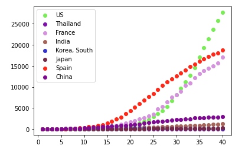

# Team7 project

    countries = ['US', 'Thailand', 'France', 'India', 'Korea, South', 'Japan', 'Spain', 'China']
    
    colors = itertools.cycle(["#"+''.join([random.choice('0123456789ABCDEF') for j in range(6)])
                 for i in range(len(countries))])
    
    
    alldata = []
    
    thresholdday = 40
    
    for country in countries:
      
      response = requests.get("https://covid-api.mmediagroup.fr/v1/history?country="+country+"&status=Deaths") 
      jsontest = response.json()
    
      dates = []
    
      for date in jsontest["All"]["dates"]:
        if len(dates) < thresholdday:
          # dates.append({'date': date, 'deaths': jsontest["All"]["dates"][date]})
          dates.append(jsontest["All"]["dates"][date])
        elif jsontest["All"]["dates"][date] >= 10:
          dates.pop(0)
          # dates.append({'date': date, 'deaths': jsontest["All"]["dates"][date]})
          dates.append(jsontest["All"]["dates"][date])
    
      dates.reverse()
      
      alldata.append({"country": country, "deaths": dates})
    
    
    x = list(range(1, thresholdday+1))
    
    for e in alldata:
      y = e["deaths"]
      plt.scatter(x, y, color=next(colors), label=e["country"])
    plt.legend()
    plt.show()
    
   